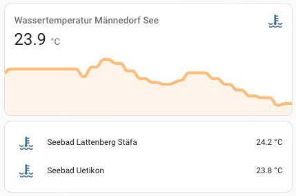
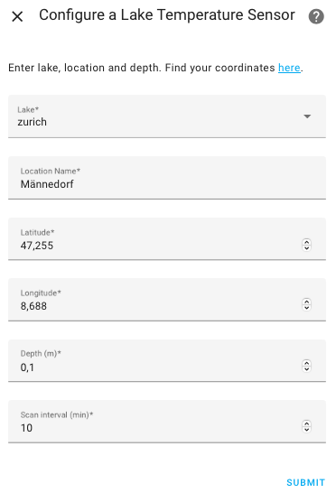

# Alplakes

<!-- Logo centered -->

  

Alplakes is a Home Assistant custom integration that fetches lake temperature data from the Eawag Alplakes API (simulations, Delft3D-Flow model) and exposes it as sensor entities. Each configured “point” (lake, latitude, longitude, depth) becomes one temperature sensor, updated on a user-configurable interval.

## Features

- Retrieves modeled water temperature at specific coordinates and depth
- Polls the Alplakes “simulations” endpoint [Delft3D-FLOW simulations](https://alplakes.eawag.ch/) on a user-configurable intervall (default: every 10 minutes)
- Supports multiple sensors (measurement stations) via UI configuration. One sensor per configured lake/latitude/longitude/depth point

  

## Installation (via HACS)

and

or

1. Go to **HACS → Integrations → ⋯ → Custom repositories**
2. Add this repo: `https://github.com/phoebos02/alplakes-ha`  
   Category: *Integration*

3. Search for `Alplakes` in HACS and install

then

4. Restart Home Assistant
5. Go to **Settings → Devices & Services → Add Integration → Alplakes**
6. Add as many sensor devices as you like

  

## Attribution

This integration uses data from the [Alplakes API](https://alplakes.eawag.ch), developed and 
maintained by [Eawag – Swiss Federal Institute of Aquatic Science and Technology](https://www.eawag.ch).  
Users must comply with the Alplakes terms of use; for full details, see Eawag's [Legal Notice](https://www.eawag.ch/en/dataprotection-disclaimer-legalnotice) and [AGB](https://www.eawag.ch/en/agb).

This project and its author are not affiliated with Alplakes or Eawag in any way.

This project and its author are not affiliated with Alplakes or Eawag in any way.

## License

BSD 3-Clause License. See [LICENSE](https://github.com/phoebos02/alplakes-ha/blob/main/LICENSE) for details.
